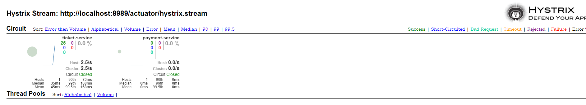
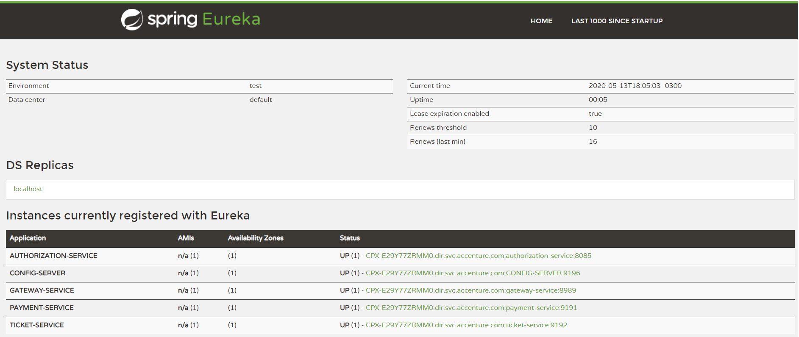
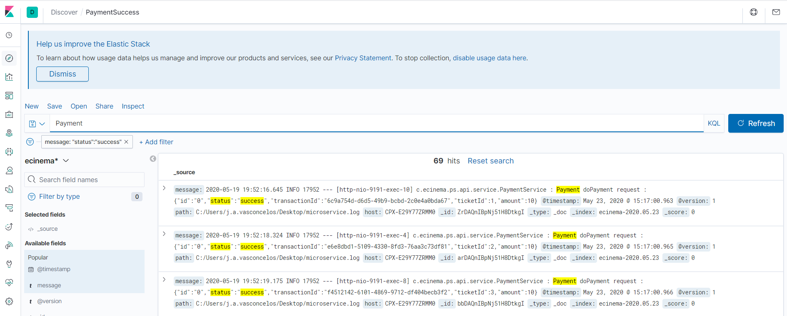
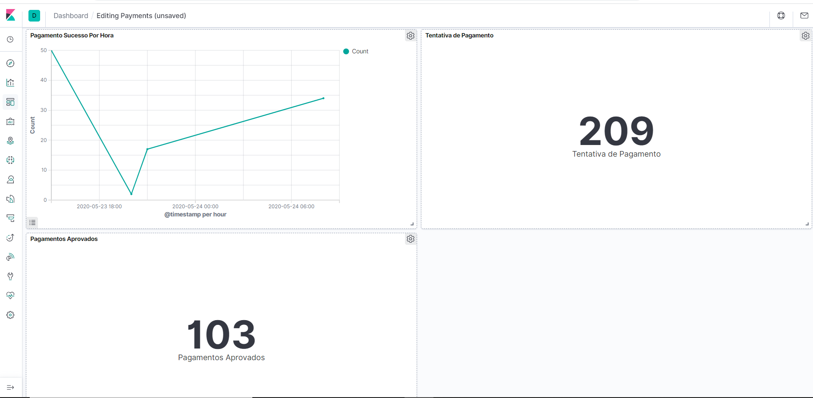

# E-Cinema Application

Example of an application in Spring Boot and Netflix OSS using fundamentals of best practices microservice architecture.

### Tools

- Java SE Development Kit
- Spring Tools IDE
- Maven
- Docker

### Methodologies and Patterns

- DDD
- TDD
- Clean Code
- Solid

## Built with:

- [Spring Boot](https://spring.io/projects/spring-boot)
- [Maven](https://maven.apache.org/)

## Microservices Architecture

### Requeriments

- The project follows [**CloudNative**](https://www.cncf.io/) recommendations and The [**twelve-factor app**](https://12factor.net/) . 


### Challenges in microservices architecture

- Configuration Management
- Dynamic Scalling Up and Down
- Load Distribution
- Visibility and Monitoring
- Common Feature Implementation
- Fault Tolerance

## Solution

### Microservices

| Microservices                   | Description  |
|---------------------------------|------------|
| Service Discovery               | [Eureka server](eureka-server) |
| Authorization-Service           | Port:8085 Responsible to allow access to microservices  |
| Ticket-Service                  | Port:9192 Responsible to provide access to ticket  |
| Payment-Service                 | Port:9191 Responsible to process payments from ticket or products  |
| Product-Service                 | Port:9193 Responsible to provide products  |
| Config-Server                   | Port:9196 Responsible to provide information and parameters for common application properties  |


### Docker Containers

```sh

#container responsible to storage cache
docker run -it --name redis -p 6379:6379  redis:5.0.3
#container responsible to persist tikcet data
docker run -- name db_postgres -e POSTGRES_PASSWORD=your_password -p 5432:5432 -d postgres 
```

### Cache

Cache is one of the approaches to optimize access to systems data, where we avoid repetitive requests in the original data sources,
which are usually large structures, complex and not always performance, so with cache, we start to consult more optimized locations,
which provide quick access through keys.

## Hystrix




## Eureka




## ELK Stack: Elasticsearch, Logstash, Kibana 

| Stack                           | Description  |
|---------------------------------|------------|
| Elasticsearch                   | NoSQL database based on the Lucene search engine |
| Logstash                        | Log pipeline tool that accepts inputs/logs from various sources  |
| Kibana                          | Kibana is a visualization UI Layer  |




